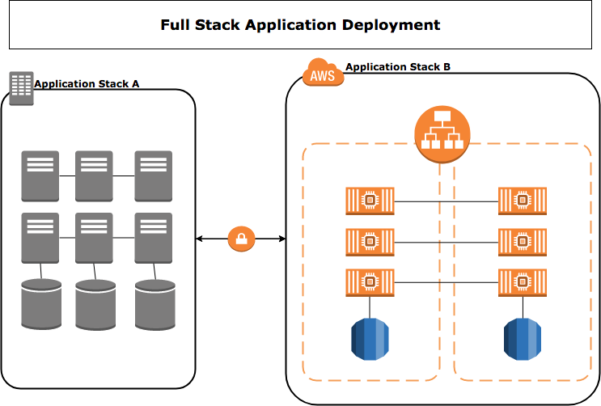

= Container Adoption Lab - Module 13

== Hybrid Environment Considerations and Architectures

=== Expected Outcome:
- Understand general architectural considerations for Hybrid Deployments.

=== Lab Requirements:
None

=== Average Lab Time:
10 Minutes.

=== Introduction
Deploying applications into a Hybrid environment requires many considerations. These include primarily latency, connection stability and connection throughput between each environment. Depending on these factors, a decision can be made regarding the specific deployment strategy for each application. We have identified

=== Hybrid Deployment Strategies
[.float-group]
--
[.left]
.Full Set Application (FSA) Deployment

[.left]
.Dependency Transit Deployment

--

==== Full Set Application Deployment.
.Key considerations:
* Low latency Dependencies
* Low Throughput Availability
* Few external dependencies

==== Full Set Application Deployment.
.Key considerations:
* Low latency Dependencies
* Low Throughput Availability
* Few external dependencies
