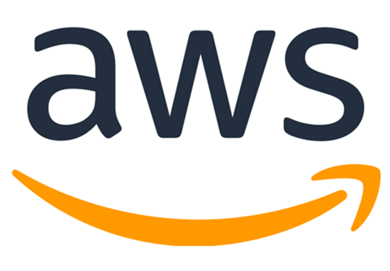

= AWS Container Migration Workshop

This is an instructor led workshop that will walk the attendee through the phases of adopting the cloud.

****
*Lab Outcomes:*

* Containerize a Wildfly application
* Learn how to deploy a productionized Kubernetes deployment

*Lab Requirements:*

* Amazon Web Services Account
* Lab Deployment resources and lab guide (This Repository)
* ...

*Expected time to complete:*
3 Hours
****

=== Previewing

[source,shell]
----
docker run -p 8080:8080 \
  -v ${PWD}:/app-data \
  -e CONTENT_URL_PREFIX="file:///app-data" \
  -e WORKSHOPS_URLS="file:///app-data/_modules.yml" \
  mandusm/workshopengine
----